# CONTEXT & ARSITEKTUR SISTEM: HATTA AKSARA PROJECT
> **Platform Profil, Media Publikasi, dan Ekosistem Jejaring Kepemimpinan Generasi Muda**  
> *Inisiatif di bawah Yayasan Proklamator Bung Hatta*

---

## 1. Latar Belakang & Identitas Inisiatif

### 1.1 Profil Singkat
**Hatta Aksara Project** adalah platform inisiatif strategis di bawah naungan **Yayasan Proklamator Bung Hatta**. Inisiatif ini dirancang untuk menyiapkan masyarakat yang berpikiran kooperatif melalui pembinaan dan pelatihan kepemimpinan berintegritas bagi generasi muda di seluruh penjuru Indonesia.

### 1.2 Pilar dan Nilai Inti
1. **Jati Diri Bangsa (*Weltanschauung*)**: Membina pemuda agar berakar kuat pada nilai-nilai kebangsaan, integritas moral, etika kepemimpinan Bung Hatta, dan kecintaan tanah air.
2. **Ekonomi Kerakyatan & Koperasi**: Menanamkan kembali kesadaran kolektif, gotong royong, dan prinsip koperasi sebagai sokoguru perekonomian bangsa.
3. **Pemberdayaan Pemuda & Kebudayaan**: Membina ketua OSIS dan pemimpin muda daerah untuk merawat kebudayaan nusantara serta mendorong pencapaian *Sustainable Development Goals* (SDGs).
4. **Program Unggulan — Indonesian Students Leadership Training (ISLT)**: Pelatihan kepemimpinan tingkat nasional bagi ketua OSIS terpilih dari seluruh provinsi di Indonesia dengan metode pelatihan kepemimpinan, diskusi ekonomi kerakyatan, dan napak tilas sejarah perjuangan pahlawan nasional.

---

## 2. Tujuan Ekosistem Web

Platform web ini dirancang bukan sekadar sebagai *company profile* statis, melainkan sebuah **ekosistem digital terpadu** yang memfasilitasi:
- **Etalase Profil & Program Publik**: Memperkenalkan visi, sejarah, dan program unggulan (ISLT dan Media Edukasi).
- **Media Publikasi Resmi & Jurnalistik**: Kanal pemberitaan resmi (*News*, *Kegiatan*, serta pelaporan dampak sosial alumni lewat *Aksi Hatta Muda*).
- **Wadah Pemikiran & Gagasan (*Idea Hub*)**: Kanal artikel dan opini pemuda terpelajar (Hatta Muda).
- **Perpustakaan Digital (*E-Jurnal & Dokumen*)**: Repositori arsip modul, kurikulum kepemimpinan, jurnal ekonomi kerakyatan, dan naskah sejarah.
- **Pintu Pendaftaran Peserta ISLT**: Sistem formulir seleksi calon peserta ISLT tanpa hambatan pembuatan akun.
- **Komunitas & Jejaring Alumni (*Hatta Muda Connection*)**: Ruang verifikasi alumni, direktori jejaring lintas provinsi, dan kontribusi tulisan berkelanjutan.

---

## 3. Aktor & Matriks Peran (Role & Permission)

Sistem membedakan hak akses menjadi 3 peran utama sesuai diagram use case:

| Aktor | Peran Utama | Hak Akses Fitur |
| :--- | :--- | :--- |
| **Guest / Publik** | Pengunjung umum, pelajar calon peserta ISLT, masyarakat luas | - Mengakses Beranda Publik<br>- Membaca Berita (News, Aksi Hatta Muda, Kegiatan) & Filter Kategori/Sub-kategori<br>- Melihat Program (Detail ISLT & Media Edukasi)<br>- Mendaftar Peserta ISLT (Formulir publik tanpa login)<br>- Membaca Artikel Gagasan Hatta Muda<br>- Mengakses & Mengunduh E-Jurnal/Dokumen<br>- Membaca Profil Lengkap (Halaman Tentang)<br>- Registrasi Akun Alumni ("Bergabung Menjadi Hatta Muda") |
| **Hatta Muda Connection** | Alumni terverifikasi dari program ISLT | - Dashboard Khusus Hatta Muda<br>- Menulis Berita "Aksi Hatta Muda" (mengirimkan naskah dampak untuk dikurasi admin)<br>- Menulis "Artikel" Gagasan/Opini (mengirimkan naskah ide untuk dikurasi admin)<br>- Memantau status tulisan (Draft, Diajukan, Revisi, Disetujui, Ditolak)<br>- Mengakses Direktori Jejaring Alumni (pencarian provinsi, angkatan, bidang, kontak publik)<br>- Mengelola profil personal & portofolio tulisan |
| **Admin / Tim Redaksi** | Pengelola yayasan & tim kurasi Hatta Aksara | - Dashboard Utama Admin (Statistik & Metrik Ringkasan)<br>- Verifikasi Akun Pendaftaran Hatta Muda (Setujui / Tolak & Hapus)<br>- Verifikasi & Moderasi Tulisan Aksi Hatta Muda (Setujui, Minta Revisi + Catatan, Tolak)<br>- Verifikasi & Moderasi Artikel Gagasan (Setujui, Minta Revisi + Catatan, Tolak)<br>- Manajemen Peserta ISLT (Tinjau, Filter Batch, Ekspor Excel/XLSX, Ekspor PDF, Sinkronisasi Google Sheets)<br>- Menulis & Mengelola Berita News & Kegiatan beserta Master Kategori/Sub-kategori<br>- Mengelola Dokumen E-Jurnal (Upload, Edit, Hapus)<br>- Mengelola Konten Program (ISLT, Media Edukasi, program tambahan)<br>- Mengelola Halaman Tentang (Sejarah, Visi Misi, Tim/Struktur) |

---

## 4. Alur & Siklus Hidup Data (Workflows)

```mermaid
graph TD
    subgraph GuestFlow [Alur Pendaftaran ISLT]
        G1[Guest Buka Menu ISLT] --> G2[Isi Form Data Diri & Sekolah]
        G2 --> G3[Submit Tanpa Akun]
        G3 --> G4[(Database: islt_applicants)]
        G4 --> G5[Admin Tinjau Data]
        G5 --> G6[Ekspor XLSX / PDF / Sinkron Google Sheets]
    end

    subgraph AlumniFlow [Alur Registrasi Hatta Muda]
        A1[Guest Registrasi Hatta Muda] --> A2[Isi Data Alumni & Angkatan ISLT]
        A2 --> A3[(Database: users - Status Pending)]
        A3 --> A4{Review Admin}
        A4 -->|Disetujui| A5[Akun Aktif & Kirim Email/Notifikasi]
        A4 -->|Ditolak| A6[Hapus dari Database Sesuai Request]
    end

    subgraph WritingFlow [Alur Publikasi Tulisan]
        W1[Hatta Muda Tulis Berita/Artikel] --> W2[Simpan Draft / Ajukan Review]
        W2 --> W3{Review Redaksi Admin}
        W3 -->|Setujui| W4[Status: Published -> Tampil di Publik]
        W3 -->|Minta Revisi| W5[Status: Revision -> Notifikasi + Catatan Perbaikan]
        W5 --> W1
        W3 -->|Tolak| W6[Status: Rejected -> Tersimpan di Arsip]
    end
```



---

## 5. Peta Struktur Web & Navigasi

```
Hatta Aksara Project Web
├── Beranda (Public Landing Page)
│   ├── Hero Section (Visi Kebangsaan & Bung Hatta)
│   ├── Quick Metric & Dampak (Jumlah Alumni, Provinsi, Program)
│   ├── Highlight Berita & Aksi Terkini
│   ├── Program Unggulan (ISLT & Media Edukasi)
│   └── Gagasan & Opini Pilihan
│
├── Berita (Media & Publikasi)
│   ├── News (Berita Resmi & Institusional)
│   ├── Aksi Hatta Muda (Dampak Nyata & Karya Alumni di Daerah)
│   ├── Kegiatan (Liputan Agenda, Diskusi, Napak Tilas)
│   └── Filter Sub-kategori: Ekonomi/Koperasi, Kebangsaan/Politik, Budaya, SDGs, dll.
│
├── Program
│   ├── ISLT (Indonesian Students Leadership Training)
│   │   ├── Pengenalan & Kurikulum ISLT
│   │   ├── Galeri Napak Tilas & Aktivitas
│   │   └── Formulir Pendaftaran Peserta ISLT
│   └── Media Edukasi
│       ├── Manifesto Platform & Ekosistem Digital
│       └── Ajakan Bergabung Alumni ("Bergabung Menjadi Hatta Muda")
│
├── Artikel (Kanal Gagasan & Pemikiran Pemuda)
│   ├── Direktori Artikel
│   └── Halaman Baca Interaktif & Profil Penulis Hatta Muda
│
├── E-Jurnal (Perpustakaan Digital)
│   ├── Katalog Dokumen, Kurikulum, & Publikasi
│   ├── Pratinjau Dokumen (PDF Reader Inline)
│   └── Unduh Dokumen Resmi
│
├── Tentang (Profil Yayasan & Inisiatif)
│   ├── Sejarah Bung Hatta & Yayasan Proklamator
│   ├── Visi, Misi, & Nilai Dasar (Weltanschauung, Koperasi)
│   └── Dewan Pembina & Pengurus Inisiatif
│
├── Portal Hatta Muda Connection (Auth Required)
│   ├── Dashboard Alumni
│   ├── Ruang Tulis Berita Aksi Hatta Muda (WYSIWYG + Status)
│   ├── Ruang Tulis Artikel Opini/Gagasan (WYSIWYG + Status)
│   ├── Direktori Jejaring Alumni (Pencarian Provinsi & Angkatan)
│   └── Profil Pribadi & Portofolio Karya
│
└── Portal Admin (Backoffice & Moderasi)
    ├── Dashboard Analitik & Ringkasan Metrik
    ├── Verifikasi Pendaftaran Alumni (Approve / Reject & Clean)
    ├── Moderasi Berita Aksi Hatta Muda (Approve / Revision / Reject)
    ├── Moderasi Artikel Gagasan (Approve / Revision / Reject)
    ├── Manajemen Pendaftar ISLT (View, Filter, Export XLSX, PDF, Google Sheets Sync)
    ├── Manajemen Berita (News & Kegiatan) + Kelola Kategori
    ├── Manajemen E-Jurnal & Dokumen
    ├── Manajemen Konten Program (ISLT, Media Edukasi, & Dinamis)
    └── Manajemen Konten Halaman Tentang
```

---

## 6. Penyempurnaan Sistem (Refinements & Best Practices)

Tanpa mengubah satupun elemen inti yang diminta, berikut aspek-aspek yang disempurnakan untuk memberikan kualitas *production-grade*:

1. **Editorial Review Feedback Loop**:
   - Ketika Admin memilih **Revisi**, sistem menyediakan input *catatan revisi* (editorial notes). Penulis Hatta Muda dapat membaca alasan perbaikan langsung di dashboard mereka, memperbarui draf, dan mengirimkan kembali (*re-submit*).
2. **Kode Registrasi Unik ISLT**:
   - Setiap peserta yang mendaftar ISLT mendapatkan nomor registrasi otomatis (format: `ISLT-YYYY-XXXXX`) dan bukti tanda pendaftaran digital yang bisa diunduh langsung atau dikirimkan via email.
3. **Mekanisme Sinkronisasi Google Sheets**:
   - Disediakan endpoint / webhook otomatis dan tombol sinkronisasi manual ke Google Spreadsheet via Service Account atau Webhook Google Apps Script, di samping tombol *instant download* XLSX dan PDF.
4. **Verifikasi Keaslian Alumni Hatta Muda**:
   - Pendaftar Hatta Muda wajib memilih tahun/angkatan ISLT dan mengunggah berkas pendukung (misal: nomor sertifikat ISLT / file bukti keikutsertaan) sehingga mempermudah admin mengambil keputusan Setujui atau Tolak.
5. **Privasi Direktori Alumni (Jejaring)**:
   - Data kontak sensitif (nomor telepon/WhatsApp) memiliki toggle privasi di profil masing-masing alumni; dapat diatur publik bagi sesama alumni terverifikasi atau hanya menampilkan tautan profil profesional (LinkedIn, Instagram, Email).
6. **Desain Visual Bernilai Sejarah & Modern (Heritage Elegance)**:
   - Palet warna berkarakter: *Deep Heritage Burgundy/Maroon* (`#781D23`), *Bung Hatta Gold Accent* (`#C29B38`), *Deep Slate Navy* (`#0F172A`), dengan latar *Clean Ivory/Off-White* (`#FBFBFB`). Memberikan kesan agung, berwibawa, historis, namun segar dan modern untuk generasi muda.
